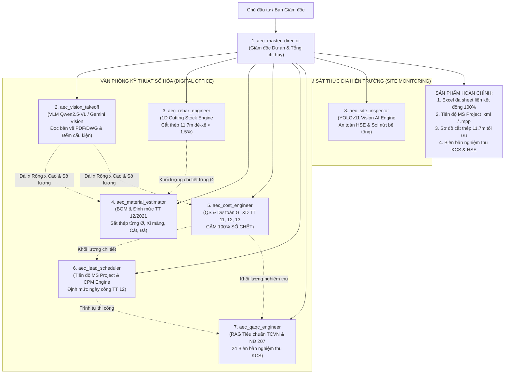

# HỆ THỐNG MẠNG LƯỚI MULTI-AGENT AEC TINH HOA (ELITE AEC AGENT NETWORK)
## KIẾN TRÚC BAN CHỈ HUY CÔNG TRƯỜNG & VĂN PHÒNG KỸ THUẬT DỰ ÁN SỐ HÓA

Hệ thống được thiết kế lại toàn diện, lựa chọn những **mô hình AI và công nghệ tốt nhất thế giới hiện nay** cho từng chuyên môn ngành Xây dựng:

---

## BẢNG TUYỂN CHỌN MÔ HÌNH TỐT NHẤT CHO TỪNG AGENT

| Agent ID | Tên chuyên môn | Công nghệ / Mô hình AI tuyển chọn tốt nhất | Vai trò cốt lõi trong hệ thống |
| :--- | :--- | :--- | :--- |
| **`aec_master_director`** | **Giám đốc Dự án & Tổng Chỉ huy** | Mô hình suy luận cấp cao (Reasoning LLM) | Lập kế hoạch Modular WBS, phân công tác tử, kiểm duyệt chéo chống số chết. |
| **`aec_cad_extractor`** | **Kỹ sư Trích xuất Bản vẽ CAD** | **CAD MCP / GsLc API** + `ezdxf` + TCVN3 Decoder | Đọc DWG/DXF, quét layer, bảng thống kê thép BBS trong CAD, bóc tọa độ đỉnh và tính diện tích mặt cắt hình học (Shoelace). |
| **`aec_office_extractor`** | **Kỹ sư Bóc tách Office & Word** | `openpyxl` + `win32com` + `python-docx` | Đọc toàn bộ bảng tính thiết kế gốc (.xlsx, .xls), bóc tách cây công thức, phân biệt số sống/chết, đọc biểu mẫu KCS Word. |
| **`aec_markdown_ingestor`** | **Kỹ sư Hồ sơ Thiết kế & Tiêu chuẩn** | Markdown Semantic Parser + Chunking | Đọc thuyết minh BPTC, chỉ dẫn kỹ thuật, trích xuất mác bê tông, mác thép, quy chuẩn TCVN, QCVN, ASTM. |
| **`aec_data_aggregator`** | **Trọng tài Hợp nhất & Trưởng ban Dữ liệu** | Data Fusion Engine + Cross-modal Diff | Đối chiếu chéo CAD vs Excel vs Markdown, phát hiện lệch pha dữ liệu, giải mã font TCVN3, đồng bộ Blackboard State chuẩn. |
| **`aec_vision_takeoff`** | **Kỹ sư Thị giác Bản vẽ (Takeoff)** | **Qwen2.5-VL / Gemini Vision** + `PyMuPDF` + `pdfplumber` | "Mắt thần" đọc bản vẽ PDF/Ảnh/DWG, quét lưới trục, tự động đếm cột, dầm, cửa và trích xuất kích thước $L \times W \times H$. |
| **`aec_rebar_engineer`** | **Kỹ sư Cốt thép Tối ưu** | Thuật toán Integer Linear Programming (1D Cutting Stock) | Tối ưu hóa cắt ghép thép thanh trên cây nguyên chuẩn **11.7m**, ép tỷ lệ đề-xê $< 1.5\%$, lập BBS chi tiết. |
| **`aec_material_estimator`** | **Kỹ sư Định mức & Cấp phối Vật tư** | Engine Định mức BXD Thông tư 12/2021 + TCVN 4453 | Phân tích cấp phối $1\text{ m}^3$ bê tông, bóc tách vật liệu cấu thành từng hạng mục WBS, lập BOM toàn công trình. |
| **`aec_cost_engineer`** | **Kỹ sư Trưởng Dự toán BoQ** | **Qwen 2.5 72B-Instruct** + RAG Định mức BXD | Lập dự toán $G_{XD}$ theo Thông tư 11, 12, 13/2021/TT-BXD, bảo đảm **100% công thức động Dài x Rộng x Cao x Số lượng x Hệ số**. |
| **`aec_lead_scheduler`** | **Kỹ sư Trưởng Tiến độ** | Thuật toán đường găng CPM + MS Project XML Engine | Tra định mức nhân công TT 12, phân bổ tổ đội thợ, xác định đường găng và xuất tệp tiến độ Microsoft Project `.xml / .mpp`. |
| **`aec_qaqc_engineer`** | **Kỹ sư Quản lý Chất lượng KCS** | RAG Tiêu chuẩn TCVN + Luật XD 135 & NĐ 207 | Lập Ma trận Tần suất thí nghiệm kiểm soát chất lượng, danh mục 22 biên bản KCS, kiểm tra logic chéo ngày tháng. |
| **`aec_site_inspector`** | **Kỹ sư Giám sát Hiện trường & HSE** | **YOLOv11** (`ppe-detection`, `concrete-crack-detection`) | Soi ảnh camera/drone hiện trường: phạt vi phạm an toàn lao động (mũ, áo, dây an toàn) và phát hiện nứt/rỗ bê tông. |

---

## CÁCH GỌI MẠNG LƯỚI TRONG ANTIGRAVITY IDE

1. **Gọi toàn bộ mạng lưới xử lý hồ sơ trọn gói:**
   > *"Hãy gọi `aec_master_director` kích hoạt mạng lưới kỹ sư xử lý hồ sơ [tên_file], bóc tách bản vẽ bằng VLM, tính dự toán G_XD, cắt thép 11.7m, lập tiến độ MS Project và danh mục KCS cho tôi."*

2. **Gọi Kỹ sư Thị giác Bản vẽ (VLM):**
   > *"Gọi `aec_vision_takeoff` đọc bản vẽ mặt bằng [file_anh hoặc PDF], đếm số lượng cửa, cột và trích xuất kích thước các phòng."*

3. **Gọi Kỹ sư Giám sát Hiện trường (HSE & Nứt bê tông):**
   > *"Gọi `aec_site_inspector` kiểm tra bức ảnh chụp công trường này xem công nhân có vi phạm an toàn không và kiểm tra vết nứt trên dầm bê tông."*
