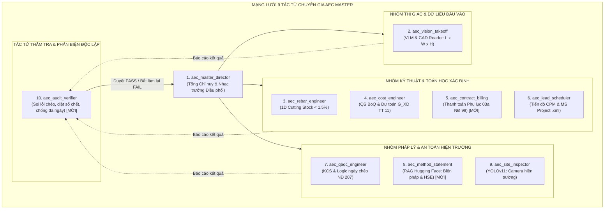
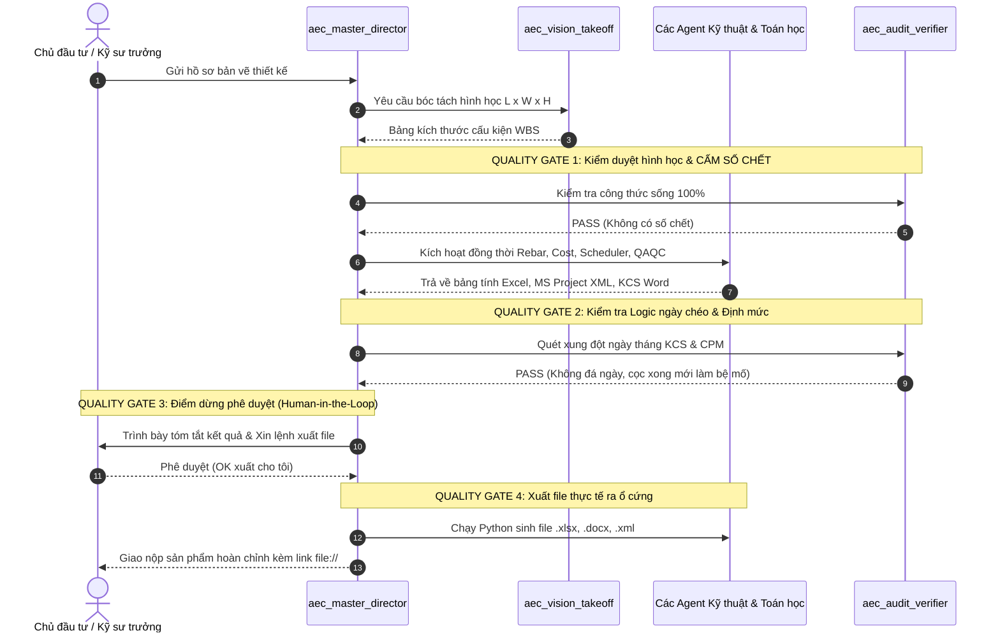

# HỆ THỐNG QUẢN TRỊ & ĐIỀU PHỐI MẠNG LƯỚI MULTI-AGENT AEC (ORCHESTRATION FRAMEWORK)
## KIẾN TRÚC ĐIỀU HÀNH PHÂN CẤP (HIERARCHICAL ORCHESTRATION & QUALITY GATES)

---

### I. RÀ SOÁT DANH MỤC AGENT: NHỮNG GÌ CÒN THIẾU ĐỂ HOÀN HẢO

Qua kiểm tra toàn bộ mạng lưới hiện tại, hệ thống đã có 7 tác tử chuyên môn rất mạnh. Tuy nhiên, để vận hành ở cấp độ **Doanh nghiệp Xây dựng lớn (AEC Enterprise)**, mạng lưới đang **thiếu 2 tác tử trọng yếu** và **1 chuẩn giao thức dữ liệu**:



#### 2 Tác tử mới cần bổ sung vào danh bạ:
1. **`aec_audit_verifier` (Kỹ sư Thẩm tra & Soi lỗi Độc lập - Red Teaming Agent):**
   - *Vai trò:* Đóng vai "Tư vấn Giám sát khó tính" hoặc "Thanh tra Xây dựng".
   - *Nhiệm vụ:* Quét toàn bộ output của các Agent khác trước khi gửi cho người dùng:
     + Quét tìm **số chết (hard-coded numbers)** trong công thức Excel.
     + Quét tìm **lỗi đá ngày tháng** giữa tiến độ thi công và biên bản nghiệm thu KCS.
     + Kiểm tra chênh lệch khối lượng giữa bản vẽ Takeoff và bảng thanh toán Phụ lục 03a.
     + Nếu phát hiện lỗi $\rightarrow$ Từ chối phê duyệt (REJECT) và ra lệnh cho Agent liên quan tính toán lại!
2. **`aec_contract_billing` (Kỹ sư Thanh quyết toán Hợp đồng):**
   - Tách bạch vai trò: Kỹ sư Dự toán (`aec_cost_engineer`) lo tính giá thầu và dự toán phê duyệt ban đầu; Kỹ sư Thanh toán (`aec_contract_billing`) chuyên trách quản lý dòng tiền thanh toán kỳ (Phụ lục 03a), quản lý tạm ứng, bảo lãnh và phát sinh hợp đồng.

---

### II. BỘ GIAO THỨC DỮ LIỆU DÙNG CHUNG (SINGLE SOURCE OF TRUTH)
Để các Agent không "hiểu nhầm nhau" hoặc dùng số liệu vênh nhau, toàn bộ hệ thống phải đọc và ghi vào một tệp trạng thái duy nhất: **`PROJECT_STATE.json`**.

```json
{
  "project_info": {
    "project_name": "Cao tốc Tuyên Quang - Hà Giang (Giai đoạn 1)",
    "bridge_name": "Cầu Km19+529.080",
    "chainage_start": "Km19+453.880",
    "chainage_end": "Km19+604.280",
    "total_length_m": 130.40,
    "span_schema": "39.1m + 40m + 39.1m",
    "superstructure": "15 phiến dầm Super-T L=38.2m, H=1.75m, BT C45",
    "substructure": {
      "M1": "Mố chân dê, 3 cọc D1200 L=20m",
      "T1": "Trụ thân đặc, 8 cọc D1200 L=40m",
      "T2": "Trụ thân đặc, 8 cọc D1200 L=30m",
      "M2": "Mố chữ U, 7 cọc D1200 L=36m",
      "total_piles": 26,
      "total_pile_length_m": 872.0
    }
  },
  "cost_summary": {
    "direct_cost_T": null,
    "indirect_cost_GT": null,
    "tax_TL": null,
    "vat": null,
    "total_G_XD": null
  },
  "schedule_cpm": {
    "start_date": "2026-10-01",
    "finish_date": "2027-03-28",
    "critical_path_tasks": []
  },
  "quality_kcs": {
    "total_bbnt": 22,
    "cross_check_status": "PASSED"
  }
}
```

---

### III. CƠ CHẾ ĐIỀU PHỐI TỐI ƯU NHẤT: 4 TRẠM KIỂM SOÁT (QUALITY GATES)

Để quản lý đàn Agent một cách thông minh, không bị rối loạn hoặc chạy vô định, hệ thống áp dụng mô hình **Hierarchical Orchestration (Bộ chỉ huy phân cấp)** kết hợp **4 Trạm kiểm soát chất lượng (Quality Gates)**:



---

### IV. BỐN NGUYÊN TẮC VÀNG ĐỂ QUẢN TRỊ AGENT KHÔNG BAO GIỜ BỊ LỖI

1. **Nguyên tắc "Ranh giới Bất khả Xâm phạm" (Boundary Isolation):**
   - Agent nào lo việc đó. Tuyệt đối không cho Agent viết Thuyết minh (`aec_method_statement`) can thiệp vào bảng tính số liệu của Agent Dự toán (`aec_cost_engineer`).
   - Mọi con số tiền tệ, khối lượng, tỷ lệ hao hụt chỉ do **Toán học xác định (Deterministic Code)** xuất ra.
2. **Nguyên tắc "Bằng chứng Kiểm định" (Audit Evidence):**
   - Mọi kết luận kỹ thuật của Agent bắt buộc phải kèm **Trích dẫn nguồn** (ví dụ: *Trang 11, Trang 71, Điều 5 TCVN 11823:2017*). Không chấp nhận câu trả lời chung chung không có căn cứ.
3. **Cơ chế Tự sửa lỗi (Self-Correction Loop):**
   - Khi `aec_audit_verifier` phát hiện lỗi (ví dụ tỷ lệ hao hụt thép $> 1.8\%$), nó không báo lỗi cho con người ngay mà tự động gửi yêu cầu về cho `aec_rebar_engineer` chạy lại thuật toán ghép phôi với thông số chặt hơn.
4. **Quyền quyết định tối cao thuộc về Con người (Human-in-the-Loop):**
   - Agent là trợ lý siêu năng lực, nhưng trước khi phát hành hồ sơ thanh toán tiền hoặc hồ sơ nghiệm thu chính thức, luôn có một bước dừng xác nhận của Kỹ sư trưởng / Người dùng.
