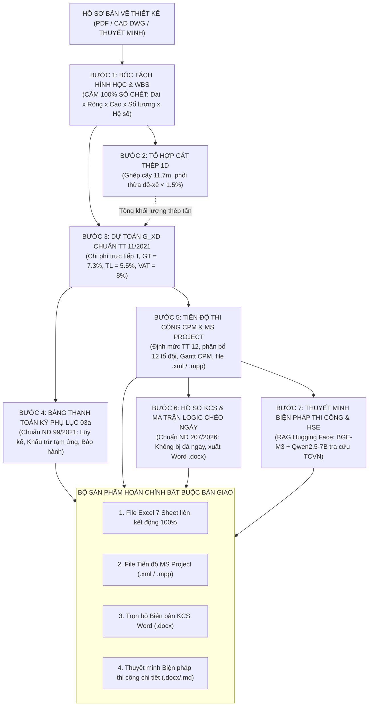

# TỔNG QUAN QUY TRÌNH QUẢN TRỊ KỸ THUẬT & DỰ ÁN AEC KHÉP KÍN (7 BƯỚC)
## HỆ THỐNG VĂN PHÒNG KỸ THUẬT SỐ HÓA & BAN CHỈ HUY CÔNG TRƯỜNG THÔNG MINH

---

### SƠ ĐỒ CHUỖI GIÁ TRỊ DỮ LIỆU KHÉP KÍN (END-TO-END PIPELINE)

---

### DANH MỤC 7 BƯỚC QUY TRÌNH CHUẨN

| Bước | Tên quy trình | Căn cứ pháp lý & Tiêu chuẩn | Đầu ra kỹ thuật | Nguyên tắc cốt lõi |
| :---: | :--- | :--- | :--- | :--- |
| **01** | **Bóc tách Takeoff & WBS** | TCVN thiết kế, Chỉ dẫn kỹ thuật | Bảng diễn giải hình học | **Tuyệt đối cấm số chết**, dòng con $= E \times F \times G \times H \times I$, dòng cha $= \text{SUM}$. |
| **02** | **Tổ hợp Cắt thép 1D** | TCVN 1651:2018 | Bảng cắt thép cây 11.7m | Thuật toán 1D Cutting Stock, ép phôi thừa đề-xê $< 1.5\%$. |
| **03** | **Dự toán tổng hợp $G_{XD}$** | Thông tư 11/2021/TT-BXD | Bảng tổng hợp chi phí $G_{XD}$ | Trỏ link trực tiếp từ Sheet QS: $GT = 7.3\% \times T$, $TL = 5.5\%$, $VAT = 8\%$. |
| **04** | **Thanh toán kỳ (Phụ lục 03a)** | Nghị định 99/2021/NĐ-CP | Bảng xác định khối lượng kỳ | Lũy kế kỳ trước, thực hiện kỳ này, khấu trừ tạm ứng $20\%$, bảo hành $5\%$. |
| **05** | **Tiến độ CPM & MS Project** | Thông tư 12/2021/TT-BXD | File tiến độ `.xml` / `.mpp` | Định mức ngày công, phân bổ tổ đội thợ, xác định đường găng Critical Path. |
| **06** | **Hồ sơ KCS & Logic chéo** | Nghị định 207/2026/NĐ-CP | Trọn bộ biên bản Word `.docx` | Ma trận logic ngày tháng không đá ngày (Cọc $\rightarrow$ Thí nghiệm $\rightarrow$ Bệ $\rightarrow$ Thân $\rightarrow$ Dầm). |
| **07** | **Thuyết minh Biện pháp (HSE)** | QCVN 18:2021/BXD, TCVN | Thuyết minh 8 chương chi tiết | RAG Hugging Face (`BAAI/bge-m3` + `Qwen2.5-7B`) tra cứu tiêu chuẩn. |

---

### TÍNH LIÊN KẾT TOÀN VẸN (ZERO BROKEN LINKS)
- Khi một thông số kích thước cấu kiện thay đổi (ví dụ chiều dài cọc, chiều cao thân mố trụ):
  1. Sheet QS tự nhảy khối lượng.
  2. Bảng tổng hợp dự toán $G_{XD}$ tự nhảy giá trị.
  3. Bảng tiến độ tự tính lại số ngày công và thời gian thi công.
  4. Khối lượng nghiệm thu trong Biên bản KCS tự động cập nhật.
  5. Giá trị thanh toán kỳ Phụ lục 03a tự động cập nhật.
- Không bao giờ cần phải chỉnh sửa thủ công rời rạc từng tài liệu!
