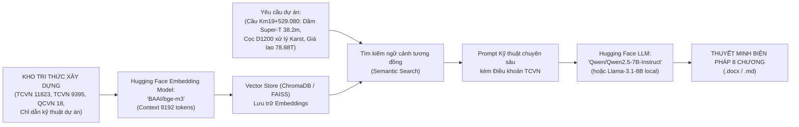

# QUY TRÌNH 07: THUYẾT MINH BIỆN PHÁP THI CÔNG & KẾ HOẠCH AN TOÀN HSE
## ỨNG DỤNG MÔ HÌNH HUGGING FACE EMBEDDING & LLM RAG CHUYÊN SÂU

---

### I. VÌ SAO PHẢI ỨNG DỤNG HUGGING FACE CHO THUYẾT MINH BIỆN PHÁP?
- Khác với Bóc tách, Dự toán và Nghiệm thu (đòi hỏi tính xác định 100% bằng code toán học), **Thuyết minh Biện pháp thi công (Method Statement) và Kế hoạch HSE** là tài liệu văn bản kỹ thuật dài từ $50 - 100$ trang.
- Tài liệu này đòi hỏi:
  1. Khả năng tra cứu, trích dẫn chuẩn xác các điều khoản từ hệ thống tiêu chuẩn kỹ thuật Việt Nam (TCVN 11823:2017, TCVN 9395:2012, TCVN 4453:1995, QCVN 18:2021/BXD).
  2. Khả năng lập luận công nghệ thi công mạch lạc, chi tiết từng bước.
  3. Khả năng phân tích đánh giá rủi ro an toàn lao động và cứu nạn cứu hộ (HIRA / JSA).
- Sự kết hợp giữa **Embedding Model (để truy xuất quy chuẩn)** và **LLM từ Hugging Face (để sinh văn bản kỹ thuật)** tạo ra cỗ máy sinh thuyết minh thi công tự động hoàn hảo nhất.

---

### II. KIẾN TRÚC MÔ HÌNH TUYỂN CHỌN TỪ HUGGING FACE

1. **Lớp Embedding (Vector Search):**
   - Model đề xuất: **`BAAI/bge-m3`** hoặc **`keepitreal/vietnamese-sbert`**.
   - Hỗ trợ đa ngôn ngữ, đặc biệt xuất sắc trong việc biểu diễn ngữ nghĩa các thuật ngữ kỹ thuật cầu đường Việt Nam.
2. **Lớp LLM Thế hệ mới:**
   - Model đề xuất: **`Qwen/Qwen2.5-7B-Instruct`** (hoặc `Qwen2.5-Coder-7B`).
   - Có năng lực viết văn bản kỹ thuật tiếng Việt chính xác, không dùng từ ngữ thừa, cấu trúc chương mục khoa học.
   - Có thể chạy offline 100% bảo mật thông qua `ollama run qwen2.5:7b` hoặc thư viện `transformers`.

---

### III. CẤU TRÚC 8 CHƯƠNG THUYẾT MINH BIỆN PHÁP CHUẨN CẦU ĐƯỜNG
- **Chương 1:** Giới thiệu chung, quy mô công trình và điều kiện hiện trường địa hình đồi núi dốc.
- **Chương 2:** Biện pháp mở đường công vụ tiếp cận và quy hoạch mặt bằng bãi đúc dầm Super-T.
- **Chương 3:** Biện pháp thi công cọc khoan nhồi $\Phi 1200\text{ mm}$ & **Quy trình xử lý hang Karst ngầm** (khoan thăm dò 5m vào đá liền khối, bơm vữa bịt hang, hạ ống vách $\Phi 1300\text{ mm}$).
- **Chương 4:** Biện pháp thi công kết cấu phần dưới (mố chân dê M1, mố chữ U M2 và trụ thân đặc T1, T2 cao $11.4 - 14.5\text{ m}$).
- **Chương 5:** Biện pháp đúc dầm Super-T $L=38.2\text{m}$ mác cao C45/55 và công nghệ căng kéo cáp DUL $\Phi 15.2\text{ mm}$.
- **Chương 6:** Biện pháp vận chuyển và lao lắp dầm bằng **Giá lao dầm ray P43 trọng lượng 78.88 tấn**.
- **Chương 7:** Biện pháp thi công dầm ngang, bản mặt cầu C35, mối nối liên tục nhiệt, khe co giãn răng lược và thảm BTN C16 dày 7cm.
- **Chương 8:** Kế hoạch quản lý an toàn lao động (HSE), bảo hộ trên cao, phòng cháy chữa cháy và phương án phòng chống bão lũ quét miền núi.
